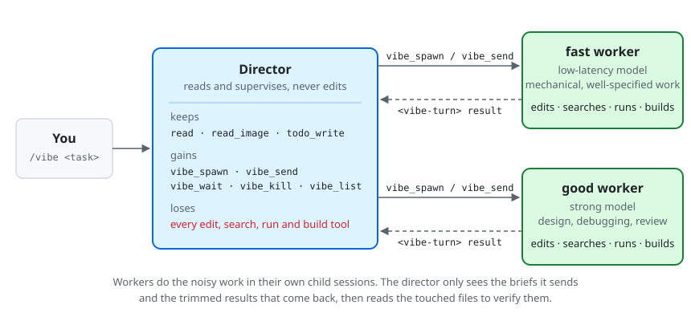

# dsh-vibe-mode

[English](README.md) | 简体中文

上下文管理是最重要的事。

这是 [omp 的 vibe 模式](https://omp.sh/docs/vibe) 在 DeepSeek Harness 上的实现。`/vibe` 把当前会话变成
**director**（主管）。director 只看不动手，改代码、搜索、跑命令、构建都交给常驻的 `fast` 和 `good`
两级 worker 子代理。worker 每做完一轮，结果都会送回 director，由它检查。



## 安装

```sh
dsh plugin --profile web add dsh-vibe-mode
```

把 `web` 换成你要启用 vibe 模式的 profile。

## 用法

```text
/vibe                      进入 vibe 模式（再运行一次即退出）
/vibe <directive>          进入 vibe 模式，并把 <directive> 发给 director
/vibe off                  退出 vibe 模式
```

vibe 模式开启期间：

- director 的工具集缩减为 `read`（预设里有的话，再加上 `read_image` 和 `todo_write`），
  外加五个 worker 工具：

  | 工具 | 输入 | 行为 |
  | --- | --- | --- |
  | `vibe_spawn` | `{ cli: fast\|good, prompt, name? }` | 启动一个常驻 worker，附上一份不依赖上下文的完整任务说明。调用后立即返回。 |
  | `vibe_send` | `{ session, message }` | worker 正在运行时用来纠偏；worker 空闲时，这条消息会开启它的下一轮。 |
  | `vibe_wait` | `{ sessions?, timeout? }` | 等到被监视的 worker 里有一个跑完当前轮次（默认最多等 30 秒），返回该轮结果。这份结果之后不会重复投递。 |
  | `vibe_kill` | `{ session }` | 取消 worker 当前的轮次并释放它。它的记录留在对应的子会话里。 |
  | `vibe_list` | `{}` | 列出所有 worker 的级别、状态、轮次数、排队消息数、模型和最近活动。 |

- worker 跑完一轮，director 的对话里会出现一个 `<vibe-turn session name cli turn status duration model>` 块，
  里面是 worker 的工具调用轨迹和它最后的回复。回复超过 `resultPreviewChars` 的部分会被截掉。
- 退出 vibe 模式后，director 拿回原来的工具，所有 worker 停止。
- 如果开着计划模式（plan mode），或者有进行中、已暂停的目标（goal），vibe 模式不会启动。
- 网页端输入框旁会出现一个 **Vibe** 标签，显示当前 worker 数量。点一下就是 `/vibe off`。

## 配置

在 profile 的 `cordis.patch.yml` 里找到本插件那一行，按需覆盖选项：

```yaml
- id: vibe-mode
  config:
    fastAgentOptions: { provider: llm-serve, model: qwen3.8-flash-next }
    goodAgentOptions: { provider: llm-serve, model: DeepSeek-v4.1-Flash-EXL3, reasoningEffort: high }
```

| 选项 | 默认值 | 含义 |
| --- | --- | --- |
| `fastAgentOptions` / `goodAgentOptions` | 继承 | 每一级的模型路由（`provider`、`model`、`reasoningEffort`、`maxTokens`）。没填的字段沿用 director 的路由。 |
| `fastProvider` / `goodProvider` | `spawn` | 每一级用的子代理 provider。 |
| `fastPersona` / `goodPersona` | 无 | 每一级 worker 的人设（persona）。 |
| `includeTodo` | `true` | director 是否保留 `todo_write`。 |
| `workerToolDeny` | `[send_message]` | 不给 worker 的工具。拿掉 `send_message` 后，worker 的结果只能作为轮次结果返回，不会变成转发消息。 |
| `waitTimeoutSeconds` | `30` | `vibe_wait` 的默认超时。 |
| `resultPreviewChars` | `4000` | `<vibe-turn>` 块里最多保留多少字符的 worker 回复。 |
| `traceLimit` | `12` | `<vibe-turn>` 块里最多列出几次工具调用。 |
| `section` | 内置 | 用自己的文本替换 director 的内置指令。 |

## 持久化

模式状态和 worker 名单完全由 harness 本来就会记录的事件推出来，所以 vibe 会话随时可以重新加载：

- `/vibe` 本身记录为 `command/run` / `command/done`。
- worker 就是标签为 `fast:<name>` / `good:<name>` 的 `subagent/catalog` 行。
- `vibe_kill` 调用成功，就算这个 worker 已终止。

恢复会话时，director 角色自动恢复，worker 回到空闲状态，级别不变。
已经被终止的 worker，以及退出模式时停掉的 worker，不会再启动。

## 开发

```sh
pnpm install
pnpm test          # vitest，连真实的 dsh 服务跑
pnpm typecheck
pnpm build         # lib/index.js（宿主端）+ lib/client.js（网页标签）
dsh plugin --profile web add /path/to/this/repo
```
